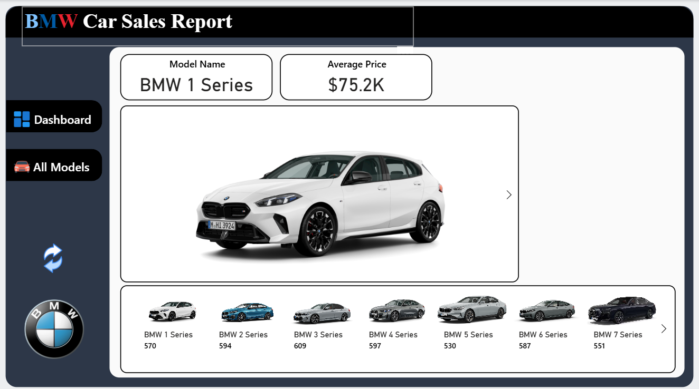

# 🚗 BMW Car Sales Report Dashboard

This project is an **interactive BMW Car Sales Report Dashboard** that visualizes sales insights, revenue trends, and top-performing models from **2019 to 2023**.  

The dashboard is designed to provide clear and data-driven insights into BMW’s sales performance, with interactive features to drill down into individual car models.

---

## 📊 Features

- **Overall Sales Summary (2019–2023)**  
  - Quantity sold: **15K units**  
  - Total Revenue: **$1bn**  
  - Previous Year Revenue (PY): **$904M**  
  - Growth: **+24.7%** 📈  

- **Revenue Trend Analysis**  
  - Yearly revenue chart with comparison to previous years.  

- **Top Selling Models**  
  - BMW 1 Series – 570 units  
  - BMW 2 Series – 594 units  
  - BMW 3 Series – 609 units  
  - BMW 4 Series – 597 units  

- **Top Expensive Models**  
  - BMW M8 – $79.1K  
  - BMW iX3 – $78.2K  
  - BMW X4 – $77.7K  
  - BMW M4 – $77.6K  

- **Model-Level Insights**  
  - Example: **BMW 1 Series** – Avg. Price $75.2K, 570 units sold.  
  - Ability to switch between models to analyze sales individually.

---

## 🖼️ Dashboard Preview

### 📍 Main Dashboard


### 📍 Model-Level Report


---

## ⚙️ Tech Stack

- **Power BI / Data Visualization Tool** – for building interactive dashboards  
- **Dataset** – BMW Car Sales Data (2019–2023)  

---

## 🚀 How to Use

1. Clone this repository:
   ```bash
   git clone https://github.com/your-username/bmw-car-sales-report.git
